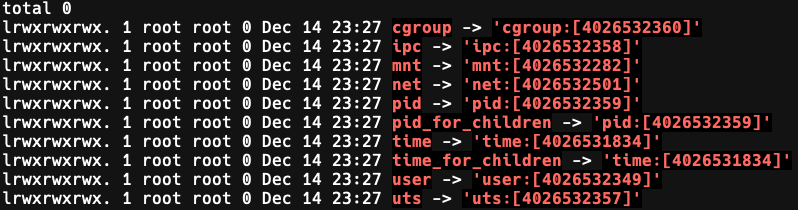

# Under the hood

Docker != containers

Containers are Linux processes with some special configurations sprinkled in. But wait! How are they isolated from the rest of the OS?
The answer is **Namespaces**, which isolate a process's view of the underlying system. When a process is run inside a new namespace, it get it's own isolated instance of global resources

## Namespaces

A feature of the Linux Kernel that limits what resources can be accessed by certain processes.
You can learn more about namespaces by reading the [man page](https://man7.org/linux/man-pages/man7/namespaces.7.html): `man namespaces`

For a brief overview of what namespaces contain you can run this command:
`docker run -it --rm ubuntu bash -c "cd /proc/1/ns && ls -l"`

And it should return something like this:

> - <u>PID namespace:</u> Isolates the process ID number space. In other words, a process running in a specific PID namespace has no knowledge of processes running in a different PID namespace.
> - <u>Network namespace:</u> Provides isolation of network controllers, system resources associated with networking, firewall rules, etc.
> - <u>Mount namespace:</u> Isolates the set of filesystem mount points seen by a group of processes. Processes in different mount(mnt) namespaces can have different views of the filesystem hierarchy.
> - <u>User namespace:</u> Isolates the user ID number space. In other words, a process's user and group IDs can be different inside and outside a user namespace. The most important aspect of this is that a process can have a normal unprivileged user ID outside a user namespace while at the same time having a user ID of 0 inside the namespace; in other words, the process has full privileges for operations inside the user namespace, but is unprivileged for operations outside.the namespace. Akin to being root inside the container while not necessarily being root in the base system running the process
> - <u>UTS namespace:</u> Allows each container to have its own hostname and domain name. UNIX timesharing system(UTX)
> - <u>IPC namespace:</u> Isolates certain interprocess communication (IPC) resources, such as System V IPC objects and POSIX message queues.
> - <u>Cgroup namespace:</u> Linux kernel feature to limit, and police resource usage by a set of processes.
> - <u>Time namespace:</u> Isolates system clocks. Each namespace has a different system time.
> - <u>Time/PID for Children namespace:</u> Special namespaces for child processes to make sure they are correctly tracked and configured 

## The truth

I lied! Namespaces are not the only linux feature required to create and operate the special processes we call containers. There are other important features such as chroot(change root) and cgroup(control group).

Both of these functionalities are important but I'll just mention that since each container requires a filesystem, we use *chroot* to create it and *cgroup* to group processes

It should also be noted that while the processes are separate and "isolated" they are not true isolated environments since they still run on the underlying system's kernel.

**Note:** If you want to check for yourself what a container engine is using try and execute: `<container engine> info`

### Quiz time

You are now ready to do a quick quiz about containers.
[Click me](containersquiz.md)

## Resources

[Docker underlying technology](https://www.codementor.io/blog/docker-technology-5x1kilcbow)

[Namespaces article](https://lwn.net/Articles/531114/)

[A great presentation about building a simple container from scratch](https://www.youtube.com/watch?v=8fi7uSYlOdc)
