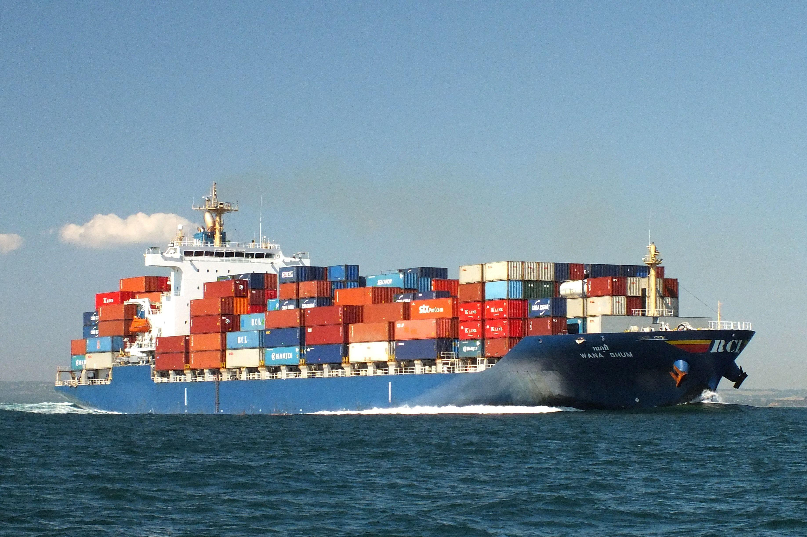

# Definition

Container shipping analogy

A container is an executable unit of software, in which a single or multiple applications are packaged into with the required runtime environment, isoleted from the rest of the system it is running on. 

The creation of containers aimed at providing an easier and faster to set up service, that could run "anywhere in the same way", wether that be **production**, **staging**, **your personal machine** and specially other people's **personal machine**.

**But in reality... what does this mean?**

It means computer goes: "brrr..." and spawns a magical new virtual computer inside the system you are running this container on. By this I mean that, much like when using a VM on your machine, a container takes advantage of the hardware resources on your machine, and it produces a piece of software which is isolated from the rest of your machine with all the bells and whistles you decided to include in the container.

Think of a container ship. All the individual containers can be dropped off at any port in the world and have whatever product inside of them. That doesn't change the fact that all the containers follow the same specifications, making them highly reproducible and reliable. This is analogous to the digital understanding of containers, they also follow certain specifications, can be deployed almost anywhere and have whatever we decid to package in them.

You'll learn more about how containers work under the hood in the next page.

## Container images

To run a container we need both an application(container engine) to run this piece of software, and instructions so that the container engine knows what to do. Container images are created from text files known as Dockerfiles. These dockerfiles are a set of instructions in which you include whatever is required to run the service you want, these instructions usally tell the container engine to add the application code, some dependencies and perform some configuration on the Operating System you chose to run the application code on.

Container images are immutable, meaning that once they are created aren't editable, to change the container image, you create a new one by editing the Dockerfile. If we want to update the dependencies that the engine will add to the container image, we edite the dockerfile and generate a new container image. This ensures consistency and reproducibility across differing environments where the container might run.

## What's the difference between a Virtual machine and a container engine?

Both aim to create isolated environments, however they go about it using different approaches. Virtual machines utilize [hypervisors](https://aws.amazon.com/what-is/hypervisor/) to achieve this goal while containers utilize underlying linux technologies.

We will not be tackling what a hypervisor is, or the different types in this workshop, however take note of the fact that an hypervisor abstracts away entire Operating Systems and enables full hardware virtualization, while container engines abstract processes withing the same Operating System.

**Note:** VM's and container engines often work together in the cloud. For instance, most cloud service providers utilize Type1(bare metal) hypervisors on which people run containerized applications.
