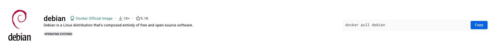

# Pulling

Let's get out hands dirty and find an image we might want to run.

First things first, we need to search for the image, for which we have a few options. We can either go to an official container image registry or we can search for it via the CLI:

> **Note:** If you are not yet authenticated, it might be requested, and if so just run `docker login` on the terminal and follow the steps, or authenticate via the docker desktop app

```sh
$ docker search debian
NAME                                  DESCRIPTION                                     STARS     OFFICIAL   AUTOMATED
ubuntu                                Ubuntu is a Debian-based Linux operating sys…   16679     [OK]
debian                                Debian is a Linux distribution that's compos…   4877      [OK]
neurodebian                           NeuroDebian provides neuroscience research s…   105       [OK]
```

We have searched for a debian image but we've gotten a few results, how do we know which one to choose?

```sh
$ docker search --format "{{.Name}}: {{.StarCount}}" --filter stars=5 debian
ubuntu: 16679
debian: 4877
neurodebian: 105
kasmweb/debian-bullseye-desktop: 6
pihole/debian-base: 5

```

It's still not really clear which image Docker will download to out computer if we do: `docker pull debian`. For that reason it's always easier to go straight to [docker hub](https://hub.docker.com/_/debian) and search there, since you have the reassurance of being able check more information.


> **NOTE:** DockerHub is not the only place to find container images at, there are other container image hubs like [quay.io](https://quay.io/search?q=debian). These alternatives may not be the best suited for you, and you should't have to worry to much about it since DockerHub is the default for a lot of container images, however, if you can't find an image for a service you want, remember to check other hubs.


From dockerhub we can see: 


So let's go ahead and download this image: `docker pull debian` 

After the download is finished, we can validate we have the expected image by doing:
`docker images | grep debian`.

```sh
$ docker images | grep debian
debian                                              latest      5d5555ed59bd  2 weeks ago   144 MB
```

But what if I want to download a specific version of a container image?
For example the debian bookworm version:
`docker pull debian:bookworm`

As simple as that!


## Running

To run a container is very simple:
```sh
$ docker run --help

Usage:  docker run [OPTIONS] IMAGE [COMMAND] [ARG...]
...
...

# Let's run the most basic example
$ docker run hello-world
```

Did you notice? When running a container, if the image is not found locally, docker will try to find one in the remote registry and pull what it thinks is the correct one.

Now let's interact enter a container with: `docker run -it ubuntu /bin/bash`

Running in interactive mode let's us "enter" the container and play around. This can be very useful for debugging purposes. But what if I just to want to run the container in the background? Let's try with a load balancer.

```sh
$ docker pull traefik:2.10
...
...

# Let's check the image ID 
$ docker images traefik:v2.10 --format "{{.ID}}"
cb72c2dc074a

# Now let's run it
$ docker run -d -p 80:80 -p 8080:8080 -v /var/run/docker.sock:/var/run/docker.sock --name reverse-proxy cb7 --api.insecure=true --providers.docker
```

When running a container image there are multiple ways to specify the image we want to execute. In this case I used the first 3 characters of the image ID which is a very standard way to do this locally, however familiarize yourself with both approaches as you will see them both. `cb7` or `traefik:v2.10`

Sometimes when running containers, we might want to keep some data that is being retrieved for persistance or necessity. If we launch a Database what happens to the data when the container is stopped? Let's do some experiments!!

```sh
$ docker run --platform linux/arm64 -d --name postgres-test -e POSTGRES_PASSWORD='password' -e POSTGRES_DB=mytestdb -p 5432:5432 postgres

# check the container is running properly
$ docker ps
CONTAINER ID   IMAGE      COMMAND                  CREATED          STATUS          PORTS                    NAMES
65fb51323cf3   postgres   "docker-entrypoint.s…"   47 seconds ago   Up 46 seconds   0.0.0.0:5432->5432/tcp   postgres-test

$ docker exec -it postgres-test psql -U postgres -d mytestdb
psql (16.1 (Debian 16.1-1.pgdg120+1))
Type "help" for help.

mytestdb=#

# Now let's add some data to the database
mytestdb=# CREATE TABLE IF NOT EXISTS public.jid_albums ( album_name VARCHAR(255) NOT NULL, goated BOOLEAN, songs INT NOT NULL);
mytestdb=# INSERT INTO jid_albums ( album_name, goated, songs) VALUES ( 'the forever story', true, 16);

# Now let's kill the container( exit by pressing <ctrl/command>+d )
$ docker rm $(docker stop postgres-test)

# You'll see that if we re-run the container the data is nowhere to be found which is expected. To fix this let's create the container with a volume 
$ docker run --platform linux/arm64 -d --name postgres-test -e POSTGRES_PASSWORD='password' -e POSTGRES_DB=mytestdb -p 5432:5432 -v postgres-data:/var/lib/postgresql/data postgres

# Now perform the same steps we did before to add some data to the DB. Exec into the container and run the SQL commands. 
# You'll see that if you leave the stop the and remove the container, and re-run with the volume, the data will still be present
```


In this example we are searching for debian images that have at least 5 stars so that we can be more certain we are getting the proper image. However, searching via the Docker CLI is not the best, since we can't see the tags or change the registry we query in the command. In this case, podman has a better search command:

```sh
$  podman search --limit 5 --list-tags --compatible docker.io/debian     
NAME                      TAG
docker.io/library/debian  10
docker.io/library/debian  10-slim
docker.io/library/debian  10.0
docker.io/library/debian  10.0-slim
docker.io/library/debian  10.1
```

### Exercises

1. There are multiple options when running containers. Play around with the debian image and the *exec* command to see if you can figure out to print to *stdout* the phrase: "platypus are real life pokemon". 

**Hint:** Exec is used for containers that are already running.

<details>
<summary>Solution</summary> 

```sh
$ docker run --name mycontainer -d -i -t alpine /bin/sh
$ docker exec -it mycontainer echo "platypus are real life pokemon"
```

</details>

2. We've used the `docker images` command to check the images we have locally, how can we remove an image?

**Hint:** `docker help`

3. If we stop a container, how can we see it's status and restart it

**Hint:** The docker cli has a command for processes which accepts some flags

## Resources

[Docker pull](https://docs.docker.com/engine/reference/commandline/pull/)

[Docker run](https://docs.docker.com/engine/reference/commandline/run/)
